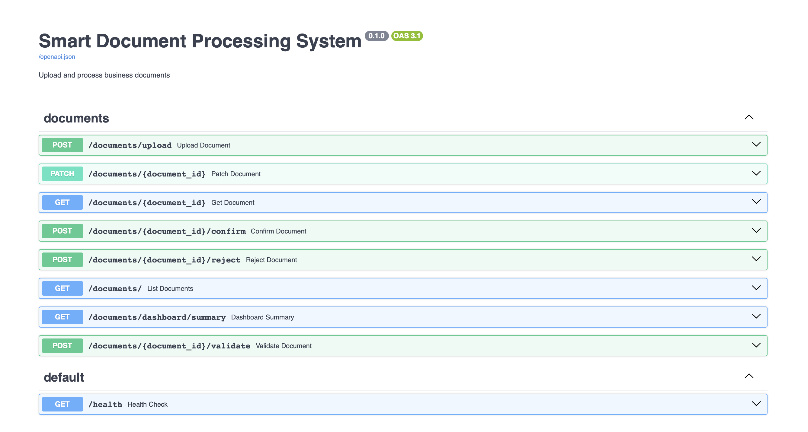
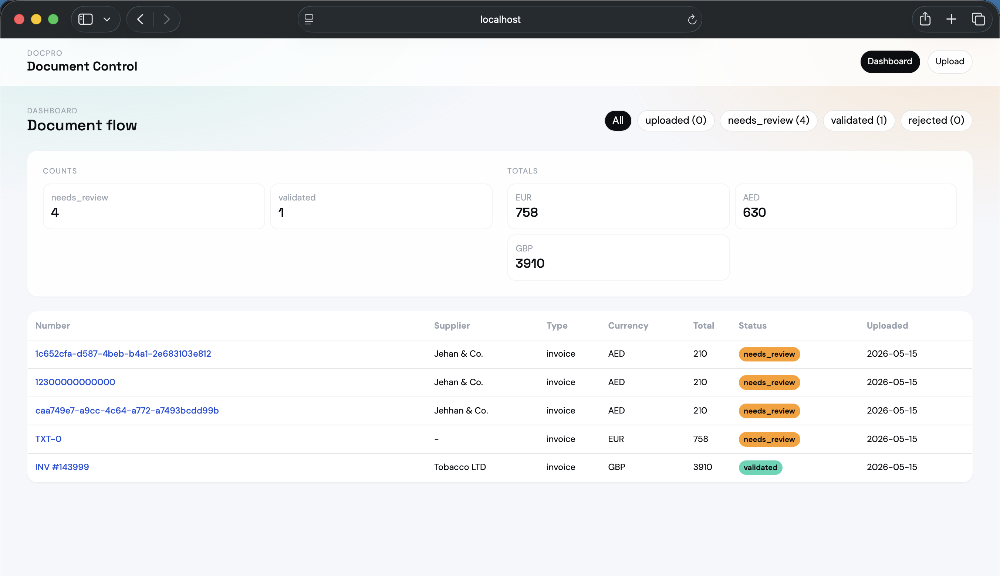
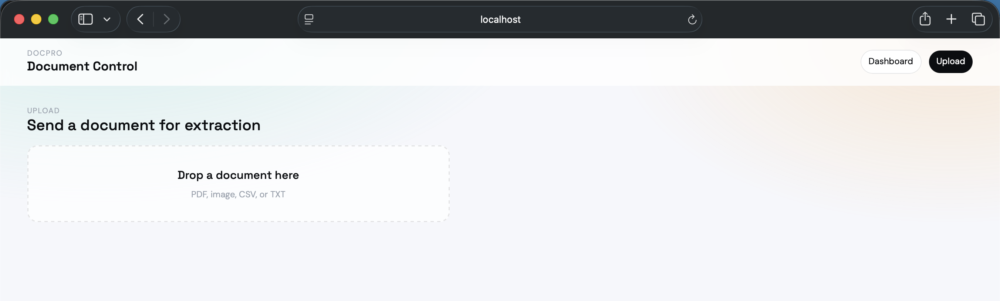
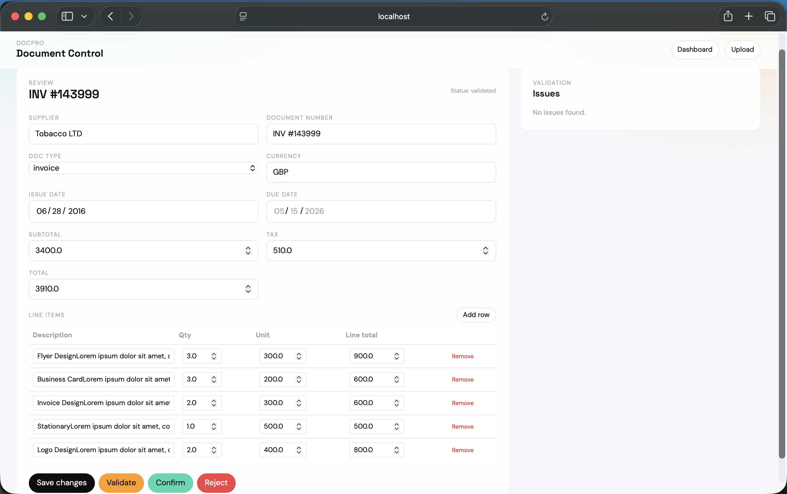
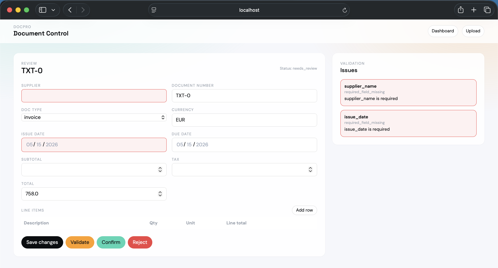

# DocPro: Smart Document Processing System

## Overview
DocPro is a full-stack document processing app for invoices and purchase orders. 
Users upload documents (PDF, images, CSV, TXT), the backend extracts structured data with an OpenAI-compatible LLM (Gemini Free Tier here), validates it with deterministic rules, and exposes a review UI for correction and confirmation.

## Tech Stack
- Backend: FastAPI, SQLAlchemy, Alembic, PostgreSQL
- Parsing: pdfplumber (PDF), LLM API (images), pandas (CSV)
- AI extraction: OpenAI-compatible LLM API
- Frontend: React, Vite, Tailwind CSS
- Deployment: Docker + docker-compose

## Setup (Local)

### Backend
1) Create `.env` in the project root with your DB and LLM settings (example):
```bash
POSTGRES_USER=postgres
POSTGRES_PASSWORD=1234
POSTGRES_DB=postgres
OPENAI_API_KEY=your_key
OPENAI_BASE_URL=url
LLM_MODEL=your_model
```

2) Create and activate a Python environment, then install dependencies:
```bash
cd backend
python -m venv .venv
source .venv/bin/activate
pip install -r requirements.txt
```

3) Run migrations and start the API:
```bash
alembic upgrade head
uvicorn app.main:app --reload
```

The API will be available at `http://localhost:8000`.

### Frontend
```bash
cd frontend
npm install
npm run dev
```

Frontend runs at `http://localhost:5173`. If the backend is not on `http://localhost:8000`, set `VITE_API_URL`.

## Setup (Docker)
```bash
docker compose up -d
```

The compose file runs Alembic migrations before the API starts. PostgreSQL data is persisted via a named volume, and uploads are mounted from `backend/uploads/`.

## Approach
1) **Ingestion**: Files are uploaded and stored locally under `backend/uploads/`.
2) **Parsing**: PDFs, CSVs, and text are parsed to raw text; images are processed with LLM-based extraction.
3) **LLM extraction**: A centralized LLM client produces structured JSON, validated with Pydantic.
4) **Validation**: Deterministic rules check totals, dates, line-item math, and required fields.
5) **Review UI**: Users edit fields, resolve issues, and confirm/reject documents.

## API Documentation:
- Access Swagger at: `http://localhost:8000/docs`
- Here's what it looks like:


## App Screenshots:
- Dashboard with KPIs:


- Upload:


- Validated document (complete):


- Incomplete document (Needs review):


## AI Tools Used
- OpenAI-compatible LLM API for text and image extraction.
- GitHub Copilot - pair coding.

## Deployment:

- BACKEND: [API DOCS](https://docpro-production.up.railway.app/docs)

- FRONTEND: 

## Known Limitations
- No authentication or user permissions.
- Synchronous processing; large files may be slow.
- No background job queue or retries.
- Limited frontend error handling for failed extraction.

## Planned Improvements
- Add a background worker for ingestion and extraction.
- Document-level audit trail and versioning.
- Expanded validation rules and configurable business logic.
- More robust API error responses and UI feedback.